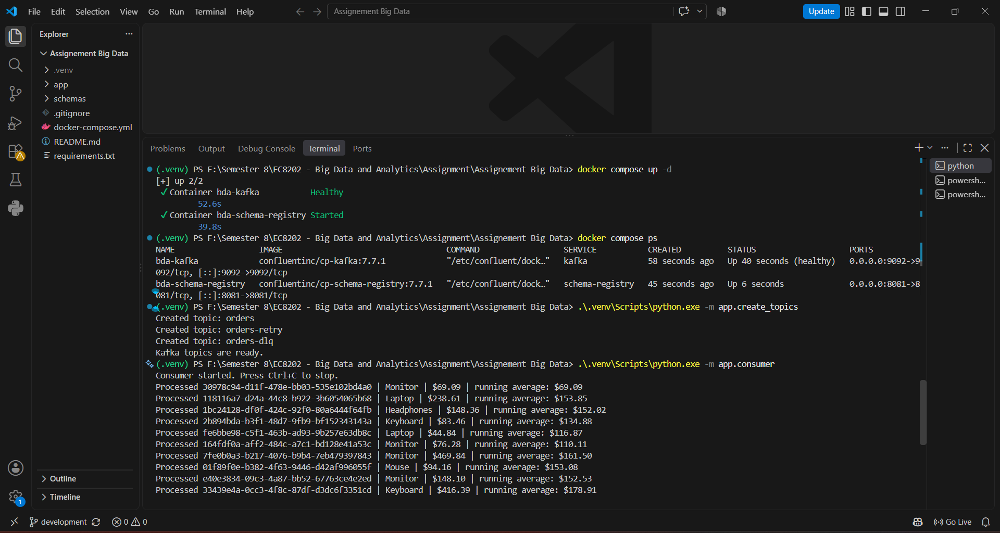
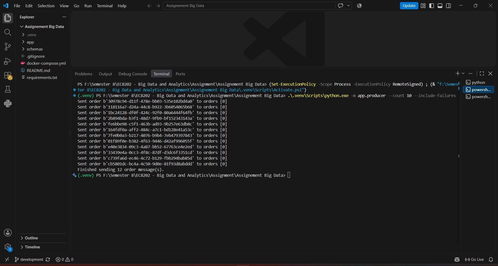
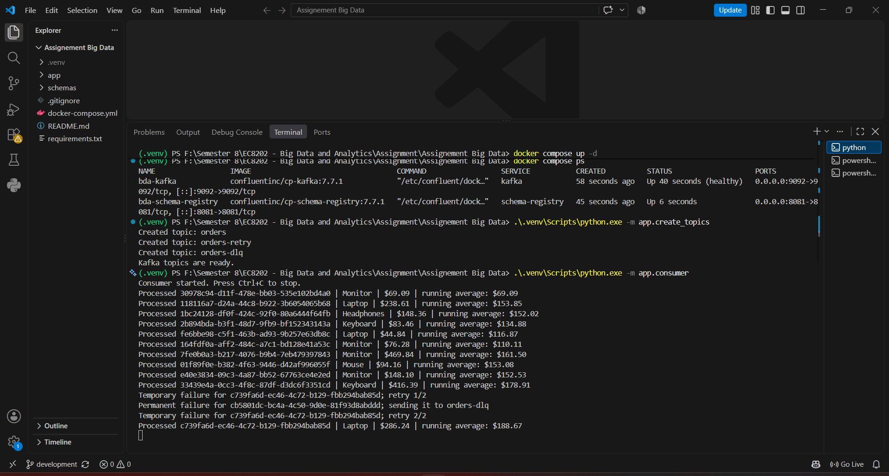
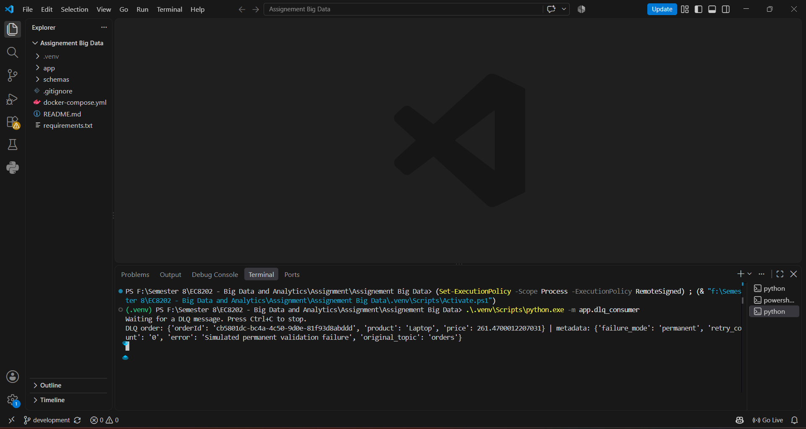

The file editor is still unavailable here, so I can’t save it directly. Replace your README with this submission-ready version:

```md
# Kafka Avro Order Processing Assignment

## Project overview

This project implements a Kafka-based order-processing system for the Big Data and Analytics assignment.

It demonstrates real-time order processing using Apache Kafka, Avro serialization, retry handling, a Dead Letter Queue (DLQ), and a continuously calculated running average of order prices.

## Requirements covered

- Avro-serialized order messages using `schemas/order.avsc`
- Kafka producer that sends randomized order messages
- Kafka consumer that calculates the running average price in real time
- Retry logic for temporary failures
- Dead Letter Queue for permanently failed messages
- Docker Compose configuration for Kafka and Confluent Schema Registry
- Git repository for project version control and submission

## Project architecture

```text
Producer --(Avro orders)--> orders topic --> Consumer --> running average

Temporary failure --> orders-retry --> Consumer

Permanent failure --> orders-dlq --> DLQ consumer
```

## Technologies used

- Python 3
- Apache Kafka
- Confluent Schema Registry
- Avro
- Docker Desktop and Docker Compose
- Git

## Prerequisites

- Docker Desktop running
- Python 3.10 or newer
- Git

## Setup

Run the following commands in PowerShell from the project folder:

```powershell
python -m venv .venv
.\.venv\Scripts\Activate.ps1
.\.venv\Scripts\python.exe -m pip install -r requirements.txt
```

Start Kafka and Schema Registry:

```powershell
docker compose up -d
docker compose ps
```

Create the required Kafka topics:

```powershell
.\.venv\Scripts\python.exe -m app.create_topics
```

## Run the live demonstration

Open three PowerShell terminals in the project folder.

### Terminal 1 - main consumer

```powershell
.\.venv\Scripts\python.exe -m app.consumer
```

The consumer processes orders, calculates the running average, retries temporary failures, and sends permanent failures to the DLQ.

### Terminal 2 - producer

```powershell
.\.venv\Scripts\python.exe -m app.producer --count 10 --include-failures
```

This sends 10 normal orders, one temporary-failure order, and one permanent-failure order.

### Terminal 3 - DLQ consumer

```powershell
.\.venv\Scripts\python.exe -m app.dlq_consumer
```

This displays the permanently failed order and its error metadata.

## Kafka topics

| Topic | Purpose |
| --- | --- |
| `orders` | New order messages sent by the producer |
| `orders-retry` | Orders that failed temporarily and must be retried |
| `orders-dlq` | Orders that failed permanently, including error metadata |

## Test results

The system was tested successfully.

| Requirement | Result |
| --- | --- |
| Kafka and Schema Registry startup | Passed |
| Kafka topic creation | Passed |
| Avro order production | Passed - 12 messages sent |
| Real-time running average | Passed |
| Temporary-failure retries | Passed - retried twice, then processed successfully |
| Dead Letter Queue | Passed - permanent failure received with error metadata |

## Screenshot evidence

Create a folder named `screenshots` in the project folder and save the images with these exact names:

| Screenshot file | What it shows |
| --- | --- |
| `screenshots/kafka-running.png` | Kafka healthy, Schema Registry running, and topics created |
| `screenshots/producer-output.png` | Producer sent 12 order messages |
| `screenshots/consumer-output.png` | Running average, temporary retries, permanent failure, and successful retry |
| `screenshots/dlq-output.png` | Failed order received by the DLQ consumer |

### Kafka services and consumer output



### Producer output



### Consumer: running average, retries, and permanent failure



### Dead Letter Queue output



## Notes

`failure_mode` and `retry_count` are Kafka headers used only to demonstrate failure scenarios. The Avro message always follows the required schema fields:

- `orderId`
- `product`
- `price`

## Stop the system

After the demonstration, stop and remove the local containers:

```powershell
docker compose down
```